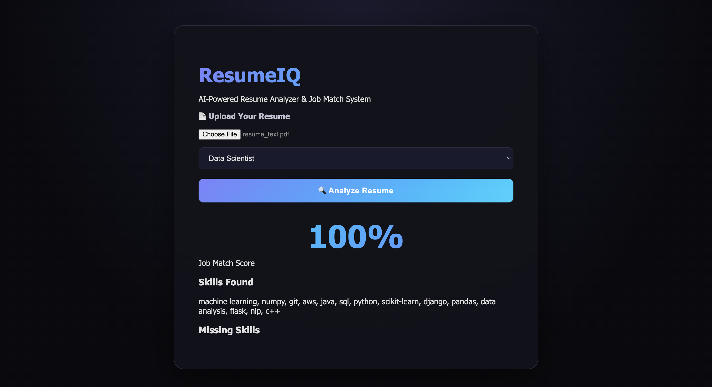

# ResumeIQ 🤖
### AI-Powered Resume Analyzer & Job Match System

## 🎯 About
ResumeIQ is a web application that analyzes PDF resumes using NLP and Machine Learning to calculate job match percentage and suggest missing skills.

## ✨ Features
•⁠  ⁠📄 PDF Resume Upload & Analysis
•⁠  ⁠🔍 Automatic Skill Extraction using NLP
•⁠  ⁠📊 TF-IDF Keyword Match Percentage
•⁠  ⁠🏆 Resume Grade Score Card (A/B/C/D)
•⁠  ⁠🤖 RAG Engine with FAISS Vector Search
•⁠  ⁠💡 Smart Skill Suggestions
•⁠  ⁠❌ Missing Skills Detection
•⁠  ⁠🎨 Beautiful Dark UI

## 🛠️ Tech Stack
•⁠  ⁠*Backend:* Python, Flask
•⁠  ⁠*AI/ML:* spaCy, Scikit-learn, NLP, TF-IDF
•⁠  ⁠*GenAI:* LangChain, RAG, FAISS
•⁠  ⁠*PDF Processing:* PyMuPDF
•⁠  ⁠*Frontend:* HTML, CSS, JavaScript

## 🚀 How to Run

1.⁠ ⁠pip install -r requirements.txt

2.⁠ ⁠python3 app.py
## 📸 Screenshots

### Upload & Analyze

### Results

